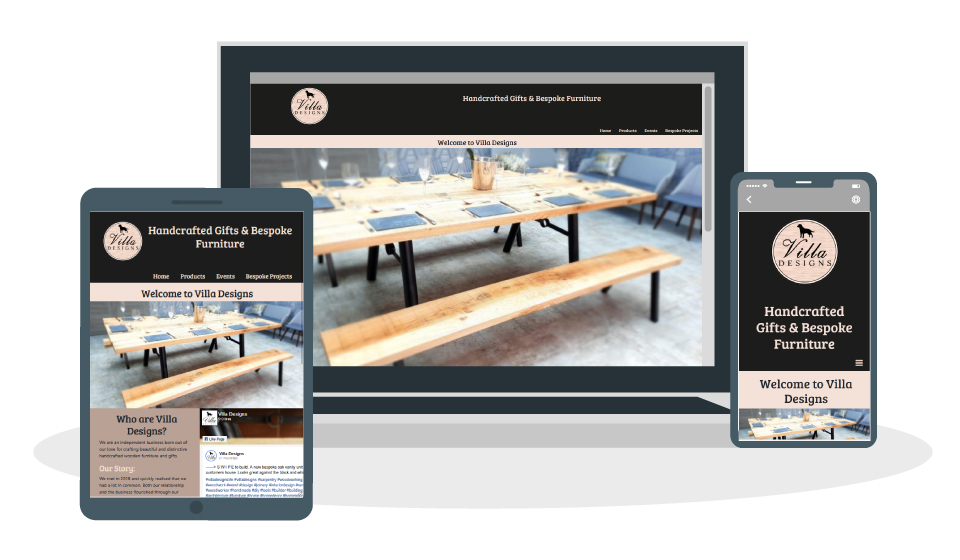

# MSP1-Villa-Designs-Website

This is the Website for [Villa Designs](https://leeap83.github.io/Villa-Designs/). Villa Designs is a local independent business that specialises in manufacturing and selling woodworking products on a made to order basis. The Website has been designed to be accessible on a range of devices.

## User Experience (UX)

**User stories**

**First Time User Goals:**
*  I want to understand the purpose of the website and learn more about the business.
*  I want to be able to navigate the website easily and be able to access the content.
*  I want to clearly see the product information & prices and be able to contact the business about purchasing products or the possibility of making a bespoke item.
*  I want to locate social media links to see if they are trustworthy.  

**Returning User Goals:**
*  As a returning visitor, I want to find out about new products.
*  I want to be able to contact the business easily.

**Site Owners Goals:**  
*  I want to raise brand awareness.
*  I want to showcase products in an appealing and eye-catching way.
*  I want customers to be able to contact me about purchasing products. 
*  I want customers to be able to contact me with bespoke project requests.
*  I want to display dates and locations of events/markets we will be at.

**Design**
*  Colour Scheme   
    Three main colours throughout the website were used to match company logo
    - #f4e1d7
    - #1c1c1b
    - #b9a195

*  Typography

    The font Bree Serief has been used for all Headers and Roboto Slab used for the content.

*  Imagery

    The main image on the homepage is designed to be eye-catching. The use of images throughout the website has been designed to showcase the products in the best light.  

* Wireframes
[Villa Design Wireframe](docs/Villa-Designs%20Wireframes.pdf)
 

 ## Features

 * Responsive on all devices
 * Links to social media
 * Contact form used
 * Interactive features
 * Facebook timeline feed 

 ## Technologies Used
 
 **Languages Used** 

 * HTML5
 * CSS3

**Frameworks, Libraries & Programs Used**

1. Bootstrap 4.5.2:
* Bootstrap was used with to assist with styling and responsiveness of the website.

2. Font Awesome:
* Font Awesome was used to provide the Icons throughout this website.

3. Google Fonts:
* Google fonts was used to import the font into the style.css file

4. Git: 
* Git was used by utilizing the Gitpod terminal to commit to Git and push to GitHub

5. GitHub:
* GitHub was used to create a repository and store the code after it was pushed from Git.

6. Photoshop:
* Photoshop was used to customise all images throughout the website and create the logo.

7. Balsamiq:
* Wireframes were created using Balsamiq

8. Adobe Illustrator:
* Adobe Illustrator was used to create the header graphics

9. Facebook for Developers:
* Facebook for Developers was used to add the timeline plugin feature to the homepage. 

## Testing

The Website was tested on Internet Explorer, Google Chrome, Firefox and Safari.
A selection of devices was used to test the website and the mobile responsiveness.

The Freeformatter HTML Validator and W3C CSS Validator Services were used to validate every page of the project to ensure there were no errors in the project.

[CSS Validator](https://validator.w3.org/) - [Results](docs/CSS-Validation.pdf)

[HTML Validator](https://www.freeformatter.com/html-validator.html) - [Results](docs/HTML-Validation.pdf)

**Testing User Stories**

**First Time User Goals:**
*  I want to understand the purpose of the website and learn more about the business.

    (a) The users are initially greeted with a header referencing what the business does.

    (b) Users are greeted with an image of a product.

    (c) On the homepage visitors can learn more about the business read about who Villa designs are. 

    [See Screenshot](docs/Screenshot.pdf)
*  I want to be able to navigate the website easily and be able to access the content.

    (a) A clear and understandable navbar has been designed so that users go between pages with ease. [See Screenshot](docs/Screenshot1.pdf)
    
    (b) All links are targeted to open a new page so users will never have to leave the page.

*  I want to clearly see the product information & prices and be able to contact the business about purchasing products or the possibility of making a bespoke item.

    (a) The users can see the product details below the image and the price is also listed. [See Screenshot](docs/Screenshot2.pdf)
    
    (b) Users can use the contact here link to enquire about products. [See Screenshot](docs/Screenshot3.pdf)

*  I want to locate social media links to see if they are trustworthy.  

    Links to social media are clearly located at the bottom of the page which will direct users to the relevant page.
    [See Screenshot](docs/Screenshot4.pdf)

**Returning User Goals:**
*  As a returning visitor, I want to find out about new products.

    (a) The Facebook Timeline will show Users New Products and any news on upcoming events. [See Screenshot](docs/Screenshot5.pdf)

    (b) New Products will be listed on the top of the products with newly listed in the products description. 

*  I want to be able to contact the business easily.

    (a) Users can find Email & Mobile links on the footer of the page throughout the website.[See Screenshot](docs/Screenshot4.pdf)

    (b) Users can find a contact link to Villa designs email address can be found at the top of the products.[See Screenshot](docs/Screenshot3.pdf)

    (c) Users can also use the contact form on the Bespoke Projects page.[See Screenshot](docs/Screenshot6.pdf)

**Site Owners Goals:**  
*  I want to raise brand awareness.

    (a) The Website provides users with exposure to the Brand and what it stands for.

    (b) Consistently showcases branding imagery through colours and fonts.

*  I want to showcase products in an appealing and eye-catching way.

    (a) Website uses imagery to showcase products in the best light.

*  I want customers to be able to contact me about purchasing products.
    
    (a) Customers at present cant buy products online but they can email a product request to Villa Designs. (this is an area to develop) 

*  I want customers to be able to contact me with bespoke project requests.

    Users can submit their project requests using the bespoke project page.

*  I want to display dates and locations of events/markets we will be at.

    The events & market location, dates are displayed on the Events page and links to the event's webpage where available so users can find out more info.

## Bugs

- On smaller devices, the Facebook feed overlaps the page

## Future Development

A shopping cart feature is an area to develop in the future currently products are made to order.  

## Deployment 

The project was deployed to GitHub Pages using the following steps...

1. Log in to GitHub and locate the GitHub Repository
2. At the top of the Repository click the "Settings" button on the menu.
3. On the Settings page locate the "GitHub Pages" Section.
4. Under "Source", click the dropdown called "None" and select "Master Branch".
5. Now above the "GitHub Pages" section the published site link will be displayed.

## Forking the GitHub Repository

Forking the GitHub repository allows you to create a copy of the original on your GitHub account where you can view or make changes without changing the original. To fork a repository you need to...

1. Log in to GitHub and locate the GitHub Repository
2. At the top of the Repository click the "Settings" button on the menu.
3. On the settings page locate the "Fork" button.
4. A copy should now be in your GitHub account.

## Creating a Local Clone

To make A local clone follow these steps...

1. Log in to GitHub and locate the GitHub Repository
2. Under the repository name, click"Clone or Download".
3. Click the "Clone with HTTPS" and copy the link.
4. Open Git Bash and change the working directory to the location where the clone will be copied to.
5. Type "git clone" and then paste the URL and press enter. and a clone will be created.

## Credits

**Code**

* Bootstrap4: Bootstrap was used throughout the project to ensure the website was responsive.

* Facebook Web Developers: the code was used from Facebook Web Developers to embed the Facebook feed on the homepage.

**Content & Media**

All content was written by the developer.

**Acknowledgements**

* My Mentor Aaron Sinnott for feedback
* Tutor support at Code Institute for their support 
* Code Institute 
* WS3 schools for reference on coding issues
 
